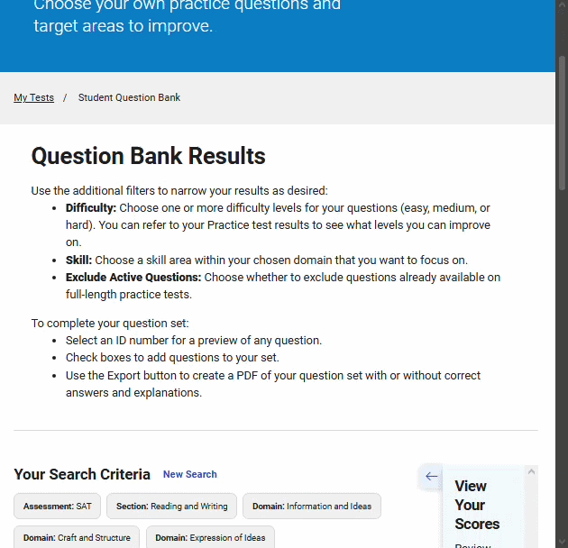

# 💳 S-ATM 💳 #
A web extension, built for Chrome-based browsers (such as Opera GX, Chrome,...) to help students planning to take the SAT have an easier time using College Board's Question Bank

## ⭐ Features ⭐ ##
- Automatic question question logging along with visual markers for "exported questions".
- Import/Export features to transfer/backup saved data
## 🤔 Why it was created 🤔 ##
### 1. Tracking questions ###
- Manually tracking exported questions take 3-5 minutes, which adds up.
- Optimization necessary if users want to manually log faster.
Not fully optimized, but an example of manual logging:

```
II:

- Last CID:
+ E: first 4, page 3.
+ M&H: first 6, page 4. (now scarce, last set finished firs 10 of page 8)

- Last INF:
+ E: first 2, page 3. (end)
+ M&H: first 7, page 6.

- Last CE:
+ E: first 10, page 5.
+ M&H: first 5, page 10.
...
```
### 2. Question Selection  ###
- Maintaining ratio of question difficulty was an annoyance.
- Additionally, work flow may be mistake prone, as it is a chain of actions: logging the exported questions, clearing filters, clearing previously selected questions, and exporting both a key version and a no-headers version 

## 🤹 Workflow 🤹 ##
### 1. Automatic Logging + Marking ###
- Questions user select are tracked.
- User confirms questions export.
- Tool saves the exported IDs, then mark questions with those IDs on the page.
### 2. Automatic question set creator (to be implemented) ###
- Users select what questions section (R&W)
- Categories of questions (Words in Context, Boundaries,...)
- Number of questions
- Difficulty ratio (how many easy, medium, hard)
- Tool filters through all of the filters, selecting the questions for them.
- Users only have to hit the export button twice (for key and no-key versions)

## 😥 Limitations 😥 ##
- Overhaul for UI
- Flexibility (extension might break of College Board makes radical changes to their site)
- Requires some user intervention
- Automation may not be fully polished.

## Demo ##


## 🔮 Future changes improvements 🔮 ##
- [ ] Improve popup UI
- [ ] Fully implement automation feaature/Remove if not worthwhile.
- [ ] Add a section for users to mark what questions they got wrong, then a dashboard for 	those mistakes so users can plan next actions easier.
- [ ] Reasoning for each mistakes too, self-reflections on why the users got the questions 	wrong/shaky answers, why answers felt tempting
- [ ] AI features could offer suggestions/recommendations regarding how to improve those 	areas.
